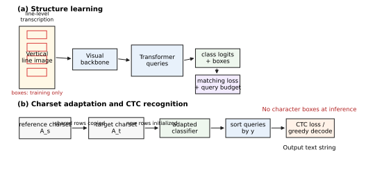

# 3. 方法

## 3.1 总体框架

本文研究裁剪后的古籍竖排单列文本识别。给定输入图像 \(x\)，模型需要预测字符序列 \(y=(y_1,\ldots,y_T)\)，其中 \(y_t\in\mathcal{A}\)，\(\mathcal{A}\) 表示目标数据集字符表。训练数据以单列图像及其行级转录为主要监督；当字符框标注可用时，SAQT 将其作为字符定位监督，而不将其作为测试阶段的必需输入。

SAQT 的核心思想是将检测式查询置于字符定位信息和行级序列识别之间。该方法由字符定位信息学习、字符表感知分类器适配和 CTC 行级识别三个部分组成。首先，模型在字符框监督下学习字符级视觉证据、字符位置及其竖直空间组织；随后，当目标字符表与定位信息查询表示对应的参考字符表不一致时，分类器适配模块继承共享字符参数，并为新增字符构造初始化；最后，模型使用行级转录进行 CTC 训练。识别阶段中，查询输出依据预测框竖直坐标排序，并作为 CTC 序列进行解码。

图 1 展示了 SAQT 的整体流程。字符框仅在字符定位信息学习阶段提供监督，推理阶段不再使用字符框；最终输出由按竖直位置排序后的查询序列经过 CTC 解码得到。

这一流程使最终系统保持序列识别器的使用形式：测试时不需要字符框，输出为文本字符串。字符框监督仅提供字符定位信息与列内组织的训练信号，分类器适配仅在字符表发生变化时启用，CTC 训练则负责将查询表示转化为最终识别能力。

## 3.2 字符定位信息学习

字符定位信息学习阶段利用带字符框的样本训练字符感知查询。对于输入图像，模型产生 \(Q\) 个查询；每个查询预测字符 logit 向量 \(\hat{s}_q\in\mathbb{R}^{|\mathcal{A}_s|}\) 和归一化字符框 \(\hat{b}_q\)。给定字符标注 \(\{(c_i,b_i)\}_{i=1}^{N}\)，二分匹配将预测查询分配给真实字符或背景。字符定位目标定义为：

$$
\mathcal{L}_{loc}
=
\lambda_{cls}\mathcal{L}_{cls}
+\lambda_{box}\mathcal{L}_{box}
+\lambda_{giou}\mathcal{L}_{giou}.
$$

其中，\(\mathcal{L}_{cls}\) 监督查询级字符分类，\(\mathcal{L}_{box}\) 与 \(\mathcal{L}_{giou}\) 监督字符定位。字符框分支不作为最终输出接口，但其几何信息为后续查询排序提供依据，使集合形式的查询能够转化为有序识别序列。

固定数量的查询为长列样本提供了充足容量，但在短列样本中也可能产生过多 nonblank 响应。为约束这一行为，本文引入长度感知的 query activation budget。对于第 \(i\) 个样本，查询 \(q\) 的 nonblank 激活及期望活跃查询数定义为：

$$
a_{i,q}=\max_c\sigma(\hat{s}_{i,q,c}),
\qquad
\hat{n}_i=\sum_{q=1}^{Q}a_{i,q}.
$$

预算由转录长度 \(T_i\) 给出：

$$
n_i^*=\alpha T_i+m,
$$

其中，\(m\) 为不确定对齐保留额外容量。该正则只惩罚超过预算的激活：

$$
\mathcal{L}_{qb}
=
\frac{1}{B}\sum_i
\frac{\max(0,\hat{n}_i-n_i^*)^2}{\max(T_i,1)}.
$$

完整的定位感知查询学习损失为：

$$
\mathcal{L}_{clq}
=
\mathcal{L}_{loc}
+\lambda_{qb}\mathcal{L}_{qb}.
$$

该约束是单侧的：它抑制过量 nonblank 激活，但不强制每个样本使用固定数量的查询。转录长度只在训练阶段用于构造正则项，推理阶段不需要提供。

## 3.3 字符表感知分类器适配

当目标字符表与参考字符表一致时，SAQT 可以直接沿用原分类器或从头训练分类器。若二者不一致，模型启用字符表感知分类器适配，以尽可能保留共享字符的分类知识。设参考字符表和目标字符表分别为 \(\mathcal{A}_s\) 和 \(\mathcal{A}_t\)。对于二者共享的字符，目标分类器继承对应参数：

$$
W_t[i]=W_s[j],\quad b_t[i]=b_s[j],
\quad \text{if } \mathcal{A}_t[i]=\mathcal{A}_s[j].
$$

对于参考字符表中不存在的目标字符，适配模块使用参考分类器中未被共享字符占用的参数行进行初始化；若可用参考字符不足，则随机复用参考分类器参数行：

$$
W_t[i], b_t[i]\leftarrow W_s[k], b_s[k],
\quad \text{if } \mathcal{A}_t[i]\notin\mathcal{A}_s.
$$

其中，\(k\) 来自参考字符表中未用于共享字符继承的索引集合；当该集合不足以覆盖全部新增字符时，\(k\) 从参考字符表索引中随机采样。该适配作用于 decoder 分类头和 encoder 输出分类头。适配后，模型先进行分类头重建，使目标分类器与定位信息查询表示对齐；随后再进行全模型识别训练。分类器适配不是独立推理模块，而是训练初始化策略，用于处理目标数据集中的新增字符或字符表重排。

## 3.4 CTC 识别训练与解码

在识别训练阶段，模型使用目标数据集的行级转录进行 CTC 训练。CTC 需要有序概率序列，而查询预测天然是集合形式。为建立二者之间的联系，本文依据预测框竖直坐标将查询从上到下排序，并将排序后的 logits 转换为带显式 blank 类的 token 概率。低置信度查询将剩余概率质量分配给 blank；高置信度 nonblank 查询在保留较小 blank 下界的同时重新归一化；相邻查询之间插入 blank-only 位置，以支持重复字符和空转移。

给定得到的概率序列 \(p_1,\ldots,p_U\)，CTC 目标为：

$$
\mathcal{L}_{ctc}
=
-\log
\sum_{\pi\in\mathcal{B}^{-1}(y)}
\prod_{u=1}^{U}p_u(\pi_u),
$$

其中，\(\mathcal{B}\) 合并连续重复 token 并删除 blank。该形式通过查询排序连接字符定位信息与序列识别，而下游监督仍只需要行级转录。

为缓解 CTC 训练中 nonblank 数量与真实字符长度不一致的问题，本文进一步采用一个轻量级的可选长度一致性辅助项。设 \(p_{u,c}\) 为排序后第 \(u\) 个 CTC 位置预测为字符 \(c\) 的概率，则样本的期望 nonblank 数量为：

$$
\hat{T}
=
\sum_{u=1}^{U}\sum_{c\neq\varnothing}p_{u,c}.
$$

给定真实转录长度 \(T\)，该辅助项约束期望 nonblank 数量与真实长度的比例接近 1：

$$
\mathcal{L}_{cnt}
=
\operatorname{SmoothL1}
\left(
\frac{\hat{T}}{\max(T,1)}, 1
\right).
$$

对于极短列样本，本文可对该项施加更高权重，以减弱 blank 过强带来的删除倾向。该项不改变模型结构和推理流程，也不引入额外输入；实验中将其作为 CTC 识别阶段的轻量辅助模块进行消融，而非 SAQT 的唯一核心设计。

推理时，greedy CTC decoding 对 blank 与 nonblank 的相对置信度较为敏感。本文在推理阶段采用轻量级 logit 校准：

$$
\tilde{z}_{u,\varnothing}=z_{u,\varnothing}+\beta_b,
\qquad
\tilde{z}_{u,c}=z_{u,c}+\beta_{nb},\ c\neq\varnothing,
$$

其中，\(z_u=\log p_u\)，\(\varnothing\) 表示 blank。偏置对 \((\beta_b,\beta_{nb})\) 由开发集校准协议确定，并在测试阶段固定。该步骤不使用语言模型或外部语料，只调整 blank 与 nonblank 的全局平衡。
