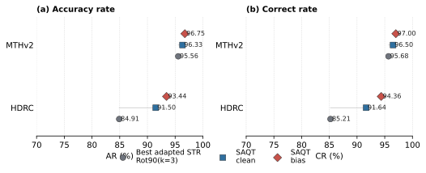

# 5. 实验结果与分析

## 5.1 主要结果

表 1 汇总 SAQT 在 MTHv2 和 HDRC 上的测试结果。所有结果均采用 dataset-level micro AR/CR。本文报告两种推理设置：direct 使用 greedy CTC 解码；calibrated 在开发集上确定全局 CTC 解码参数，并在测试集上固定使用，以避免基于测试集调参。

| Dataset | Decode | Calibration | Samples | AR | CR |
| --- | --- | ---: | ---: | ---: | ---: |
| MTHv2 | direct | 0/0 | 10455 | 96.33 | 96.50 |
| MTHv2 | calibrated | -2.0/0.8 | 10455 | 96.75 | 97.00 |
| HDRC | direct | 0/0 | 3381 | 91.50 | 91.64 |
| HDRC | calibrated | -2.0/1.0 | 3381 | 93.44 | 94.36 |

在直接解码下，SAQT 在 MTHv2 上取得 96.33/96.50 的 AR/CR，在 HDRC 上取得 91.50/91.64 的 AR/CR。采用开发集确定的推理参数后，MTHv2 的 AR/CR 为 96.75/97.00，HDRC 的 AR/CR 为 93.44/94.36。后续比较同时保留 direct 与 calibrated 结果，其中 direct 反映模型本身的未校准 CTC 输出，calibrated 反映固定推理协议下的最终识别性能。

## 5.2 与适配后场景文本识别方法的比较

表 2 给出经竖排输入适配的场景文本识别方法在相同测试集上的结果。为避免评价协议差异造成偏差，所有基线输出均被转换为与 SAQT 相同的 micro AR/CR 指标。

| Dataset | Model | Orientation | AR | CR |
| --- | --- | --- | ---: | ---: |
| MTHv2 | CRNN | Rot90(k=3) | 95.51 | 95.63 |
| MTHv2 | SVTR-tiny | Rot90(k=3) | 95.56 | 95.68 |
| MTHv2 | SVTR-small | Rot90(k=3) | 95.34 | 95.44 |
| MTHv2 | SVTR-L | Rot90(k=3) | 95.16 | 95.26 |
| MTHv2 | ABINet | Rot90(k=3) | 90.75 | 90.91 |
| MTHv2 | SAR | Rot90(k=3) | 73.20 | 87.65 |
| HDRC | CRNN | Rot90(k=3) | 84.91 | 85.21 |
| HDRC | SVTR-tiny | Rot90(k=3) | 83.71 | 83.89 |
| HDRC | SVTR-L | Rot90(k=3) | 78.16 | 78.43 |
| HDRC | ABINet | Rot90(k=3) | 77.61 | 77.84 |
| HDRC | SAR | Rot90(k=3) | 70.74 | 73.24 |

在 MTHv2 上，SAQT 直接解码的 AR/CR 为 96.33/96.50，高于本文比较范围内表现最接近的 SVTR-tiny，其 AR/CR 为 95.56/95.68；采用同一校准协议后，SAQT 达到 96.75/97.00。HDRC 上，SAQT 直接解码的 AR/CR 为 91.50/91.64，高于最接近的 CRNN 基线 84.91/85.21；校准后对应结果为 93.44/94.36。该比较说明，在相同测试集和统一 AR/CR 评估协议下，SAQT 相较于本文纳入的竖排适配场景文本识别基线取得了更高的识别指标；各训练模块的独立贡献仍需由消融实验进一步分离，而校准主要作为推理阶段的轻量补充。

图 2 进一步可视化了 SAQT 与表现最接近的适配后场景文本识别基线之间的 AR/CR 对比。MTHv2 上对应基线为 SVTR-tiny，HDRC 上对应基线为 CRNN。

## 5.3 Query Activation Budget 的影响

字符定位信息学习中，固定数量查询需要同时覆盖长列样本和短列样本。为考察 query activation budget 的影响，表 3 比较了 MTHv2 上不使用该约束与使用该约束的结果。两组实验均在相同测试集和统一 AR/CR 协议下评估。

| Setting | Decode | Calibration | Samples | AR | CR |
| --- | --- | ---: | ---: | ---: | ---: |
| w/o query budget | direct | 0/0 | 10455 | 95.53 | 95.71 |
| w/o query budget | calibrated | -2.0/1.0 | 10455 | 96.10 | 96.37 |
| w/ query budget | direct | 0/0 | 10455 | 96.17 | 96.29 |
| w/ query budget | calibrated | -2.0/0.8 | 10455 | 96.69 | 96.90 |

在直接解码下，query budget 将 AR/CR 从 95.53/95.71 提升至 96.17/96.29；在采用同一开发集校准协议后，AR/CR 从 96.10/96.37 提升至 96.69/96.90。该结果与本文的设计动机一致：长度感知的查询激活约束在保持查询容量的同时，有助于减少过量 nonblank 激活对 CTC 序列建模的干扰。由于当前消融集中在 MTHv2 上，该结论应理解为对模块有效性的内部证据，而非跨数据集充分验证。

为进一步观察带 query-budget 的定位信息查询表示在 HDRC 上的下游效果，本文补充评估一个 qbudget-localization-query 变体。该变体使用带 query-budget 约束的定位信息查询表示，并采用与 HDRC 主线相同的分类头重建、全模型识别训练和解码校准协议。需要强调的是，该设置同时包含额外的定位信息学习差异，因此不应被解释为 query budget 的单因素因果消融。

| Dataset | Variant | Decode | Calibration | Samples | AR | CR |
| --- | --- | --- | ---: | ---: | ---: | ---: |
| HDRC | mainline | direct | 0/0 | 3381 | 89.99 | 90.33 |
| HDRC | mainline | calibrated | -2.0/0.4 | 3381 | 90.70 | 91.80 |
| HDRC | qbudget-localization-query | direct | 0/0 | 3381 | 91.50 | 91.64 |
| HDRC | qbudget-localization-query | calibrated | -2.0/1.0 | 3381 | 93.44 | 94.36 |

在 HDRC 上，该变体的直接解码 AR/CR 达到 91.50/91.64，高于主线直接解码的 89.99/90.33；采用开发集选择的解码校准后，AR/CR 达到 93.44/94.36，高于主线的 90.70/91.80。该结果为定位信息查询表示与 query activation budget 的组合提供了额外目标域证据，但其结论强度应限定为变体级比较。

## 5.4 长度一致性辅助项的影响

表 4 比较了 MTHv2 上不使用与使用 CTC expected-count 辅助项的结果。两组实验使用相同的 query-budget 分支和相同的测试协议；差异在于识别训练阶段是否加入长度一致性辅助项。

| Setting | Decode | Calibration | Samples | AR | CR |
| --- | --- | ---: | ---: | ---: | ---: |
| w/o expected-count | direct | 0/0 | 10455 | 96.17 | 96.29 |
| w/o expected-count | calibrated | -2.0/0.8 | 10455 | 96.69 | 96.90 |
| w/ expected-count | direct | 0/0 | 10455 | 96.33 | 96.50 |
| w/ expected-count | calibrated | -2.0/0.8 | 10455 | 96.75 | 97.00 |

加入 expected-count 辅助项后，MTHv2 直接解码 AR/CR 从 96.17/96.29 提升到 96.33/96.50，校准解码从 96.69/96.90 提升到 96.75/97.00。该增益幅度有限，但在直接解码和同一校准协议下方向一致，说明长度一致性约束可以作为 CTC 识别训练中的轻量补充。需要注意的是，HDRC 上的同类尝试未形成稳定收益，因此本文不将该辅助项表述为跨数据集普适的核心模块。

## 5.5 字符表感知分类器适配的影响

为考察目标字符表变化时分类头初始化方式的影响，表 5 在 HDRC 上比较随机初始化目标分类头与字符表感知初始化。两组实验使用相同的字符定位查询表示、相同的分类头重建与全模型识别训练流程，并在相同测试集上报告 AR/CR。校准解码结果均采用开发集选参、测试集固定的协议。

| Initialization | Decode | Calibration | Samples | AR | CR |
| --- | --- | ---: | ---: | ---: | ---: |
| random target head | direct | 0/0 | 3381 | 81.01 | 81.41 |
| random target head | calibrated | -1.2/1.0 | 3381 | 82.72 | 83.97 |
| charset-aware | direct | 0/0 | 3381 | 89.99 | 90.33 |
| charset-aware | calibrated | -2.0/0.4 | 3381 | 90.70 | 91.80 |

随机初始化目标分类头后，即使经过相同的全模型识别训练，HDRC 上的 AR/CR 仍明显低于字符表感知初始化。该结果说明，在目标数据集字符表发生变化时，继承共享字符分类参数有助于保留已学习到的视觉-字符对应关系；同时，新增字符的参数初始化仍需要后续分类头重建和全模型识别训练来适配目标域。该消融目前在 HDRC 上闭合，应理解为字符表适配模块的目标域证据，而非所有古籍数据集上的充分验证。

## 5.6 分类头重建与全模型识别训练的影响

SAQT 的识别训练包含分类头重建和全模型识别训练两个阶段。为分析仅更新分类头是否足够，表 6 在 MTHv2 和 HDRC 上比较仅完成分类头重建的 checkpoint 与继续进行全模型识别训练后的结果。每个数据集的校准结果均采用对应开发集选择的解码参数，并在测试阶段固定。为保持训练阶段对照的可比性，MTHv2 这里使用不含 expected-count 辅助项的 query-budget 分支，HDRC 使用字符表适配主线分支。

| Dataset | Training stage | Decode | Calibration | Samples | AR | CR |
| --- | --- | --- | ---: | ---: | ---: | ---: |
| MTHv2 | head reconstruction only | direct | 0/0 | 10455 | 93.00 | 93.42 |
| MTHv2 | head reconstruction only | calibrated | -0.8/1.0 | 10455 | 93.83 | 95.03 |
| MTHv2 | full recognition training | direct | 0/0 | 10455 | 96.17 | 96.29 |
| MTHv2 | full recognition training | calibrated | -2.0/0.8 | 10455 | 96.69 | 96.90 |
| HDRC | head reconstruction only | direct | 0/0 | 3381 | 82.28 | 82.68 |
| HDRC | head reconstruction only | calibrated | -2.0/0.4 | 3381 | 85.97 | 89.72 |
| HDRC | full recognition training | direct | 0/0 | 3381 | 89.99 | 90.33 |
| HDRC | full recognition training | calibrated | -2.0/0.4 | 3381 | 90.70 | 91.80 |

仅重建分类头已经能够产生可用识别结果，但在两个数据集上均低于全模型识别训练。采用开发集选择的解码校准后，MTHv2 仅分类头重建的 AR/CR 为 93.83/95.03，而全模型识别训练达到 96.69/96.90；HDRC 仅分类头重建为 85.97/89.72，而全模型识别训练达到 90.70/91.80。该结果说明，识别阶段不仅需要调整输出字符分类器，还需要更新视觉特征、查询表示和 CTC 序列转换相关参数。

## 5.7 局限性

当前实验仍存在若干限制。首先，SAQT 的字符定位信息学习依赖字符框监督，其适用性取决于是否能够获得少量或已有的字符级位置标注；本文主要通过与竖排适配场景文本识别基线的比较来评估该设计的整体有效性，尚未完成定位监督收益的完整因果分解。其次，解码校准只能调整 CTC 空白路径与字符路径的相对权重，无法解决相似字符混淆或严重图像退化。第三，本文实验主要覆盖 MTHv2 和 HDRC；query budget 的单因素消融主要在 MTHv2 上完成，HDRC 上的结果来自 qbudget-localization-query 变体，不能完全分离 query budget 与定位信息查询表示差异。expected-count 辅助项在 MTHv2 上带来小幅收益，但 HDRC 上未形成稳定改进，因此只应视为轻量可选模块。字符表适配消融主要在 HDRC 上完成。在更大字符表和更强域差异条件下，各模块的独立贡献仍需进一步评估。
